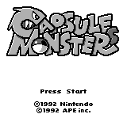
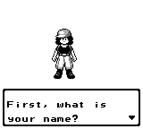
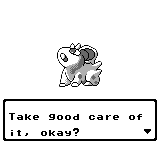
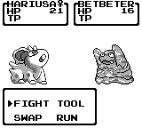

# Capsule Monsters

The year is 199X. In Masara Town, a quiet settlement in the Kanto region, an eleven-year-old child hears of Dr. Ookido, better known as Dr. Capmon, a scholar devoted to studying the mysterious creatures that inhabit their world: Capsule Monsters. And he's living in Tokiwa City, a short walk from Masara!
With a trusted partner Capmon by their side, the child sets out on a grand adventure to meet Dr. Capmon, uncover the secrets about these creatures, and battle their way to the very top... to become the greatest DEALER in the entire region.

**Capsule Monsters**, which would later be renamed Pocket Monsters, was the initial idea GameFreak had for a Monster Taming game.

This is a custom game based on [the Pokémon Red and Pokémon Blue disassembly](https://github.com/pret/pokered). It aims to create a new experience using the earliest assets available. A "what if" scenario.

Keep in mind that it's supposed to be a simpler RPG, even more simple than the very first Pokémon games. It takes inspiration from early RPGs, such as Dragon Quest/Warrior, Final Fantasy Legend, etc.

 
 

## Links

- **pret:** [click here][pret]

[pret]: https://github.com/pret/
